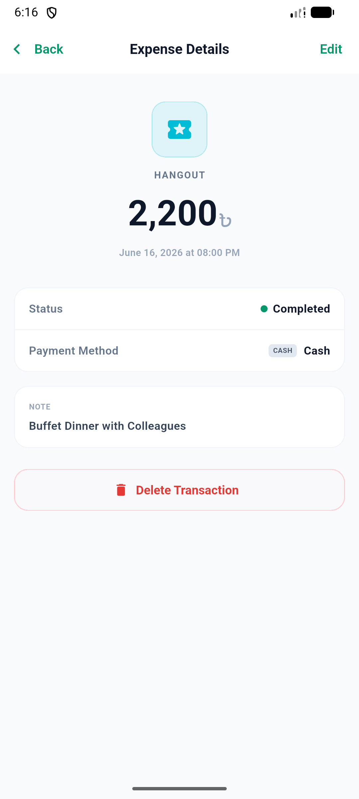

# FinKeep

A personal finance management application built with Flutter and Firebase to track expenses and
manage budgets efficiently.

## 🎥 Demo

Below are some screenshots showcasing the features of the app:

<table>
  <tr>
    <td></td>
    <td></td>
    <td></td>
  </tr>
  <tr>
    <td></td>
    <td></td>
    <td></td>
  </tr>
  <tr>
    <td></td>
    <td></td>
    <td></td>
  </tr>
</table>
 

### 🚀 Live Link

🟢 [Google Play Store](https://play.google.com/store/apps/details?id=com.raindropstudio.finkeep)

## 🚀 Features

- Expense Tracking: Log daily expenses and income with categories.
- Budget Management: Set monthly limits and monitor spending.
- Track your income of different categories
- Configure custom income and expense category
- Keep track of lends with smart tracking
- Keep an eye on your investments
- Cloud Sync: Securely backup data using Firebase.

## 🛠️ Tech Stack

- Flutter
- GetX
- Firebase
- Hive
- Local Notification
- Push Notification

## 🚧 Installation & Usage

1. Clone the repository: `git clone https://github.com/your_username/awesome-app.git`
2. Navigate to the project directory: `cd awesome-app`
3. Get dependencies: `flutter pub get`
4. Run the app: `flutter run`

## 📃 Motivation

## 🏛️ Architecture/Design

- Clean Architecture

## 📦 Packages Used

- [Firebase core](https://pub.dev/packages/firebase_core)
- [GetX](https://pub.dev/packages/get)
- [Hive](https://pub.dev/packages/hive)
- [Firebase Messaging](https://pub.dev/packages/firebase_messaging)
- [Flutter Local Notifications](https://pub.dev/packages/flutter_local_notifications)
- Firebase messaging

## 📞 Contact

For any inquiries or collaboration requests, feel free to reach out
via [email](mailto:alxayeed@gmail.com) or connect
on [LinkedIn](https://www.linkedin.com/in/alxayeed).

## 📌 Other Projects

Check out our other awesome projects:

- [Cool Utility Tools](https://github.com/your_username/cool-utility-tools)
- 
- 
