# 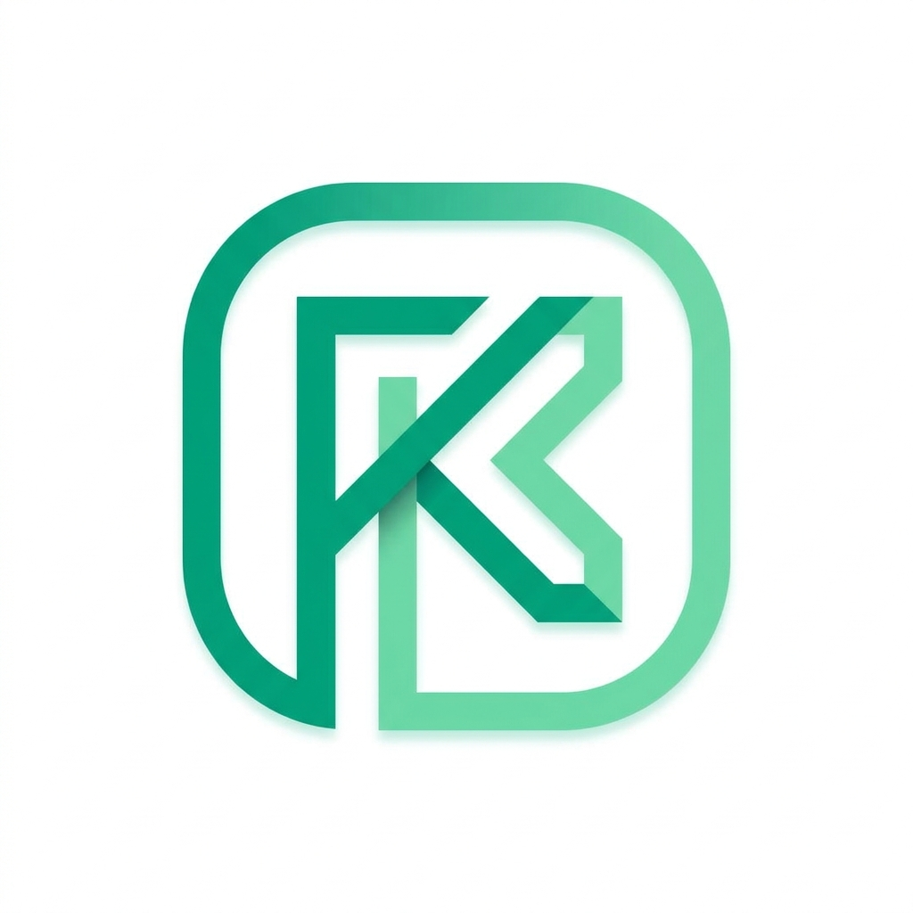 FinKeep

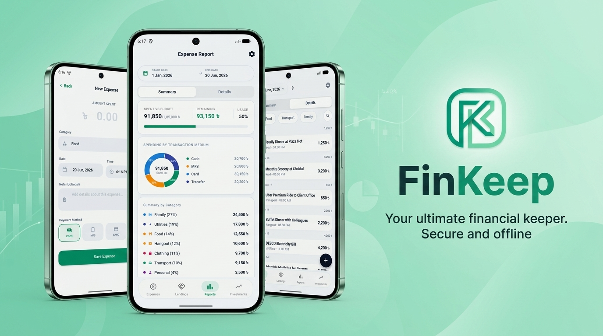

Take complete control of your finances with **FinKeep**, a secure, local-first personal finance tracker. Designed with absolute privacy in mind, FinKeep keeps your sensitive financial records stored securely on your device—without requiring bank credentials or exposing your data to unverified cloud tracking.

For users who want cross-device availability, FinKeep offers a **Personal Cloud Sync** toggle powered by Firebase. Whether you choose pure local-first offline storage or secure personal cloud backups, FinKeep brings your daily expenses, monthly budgets, debt tracking, and investment yields into one premium, clean, and intuitive dashboard.

---

## 📷 App Preview & User Interface

FinKeep features a modern, responsive user interface styled with harmonious palettes, sleek dark mode support, and readable data typography.

<table>
  <tr>
    <td align="center" width="33%"><b>Dashboard</b><br/>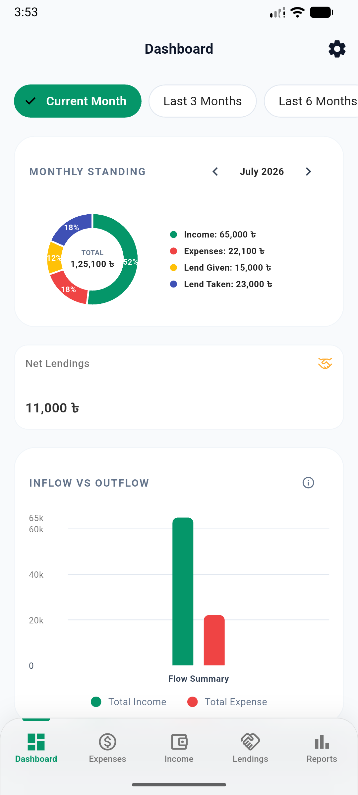</td>
    <td align="center" width="33%"><b>Monthly Budget</b><br/>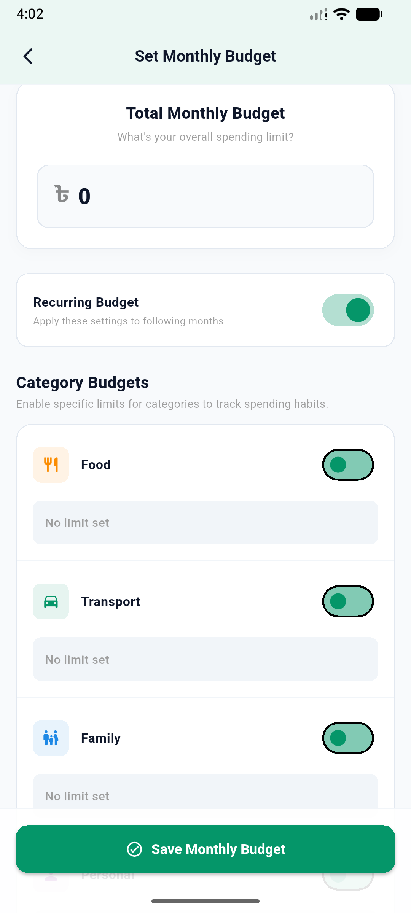</td>
    <td align="center" width="33%"><b>Expense List</b><br/>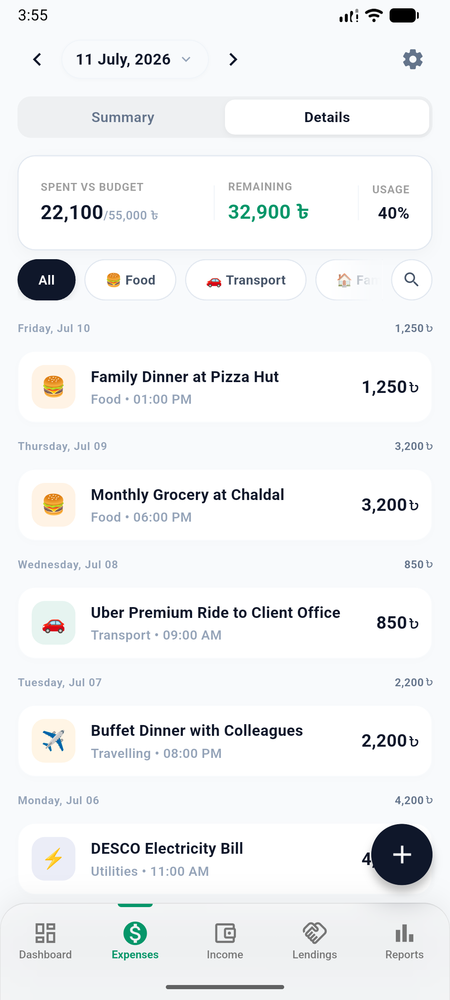</td>
  </tr>
  <tr>
    <td align="center" width="33%"><b>Expense Summary</b><br/>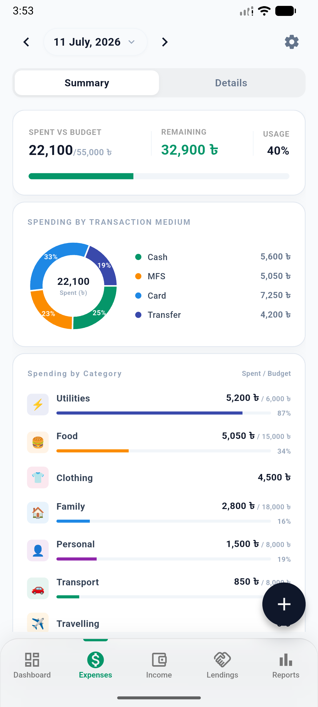</td>
    <td align="center" width="33%"><b>Detailed Reports</b><br/>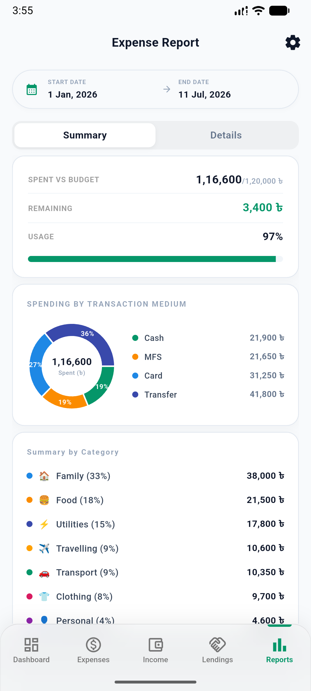</td>
    <td align="center" width="33%"><b>Add Expense</b><br/>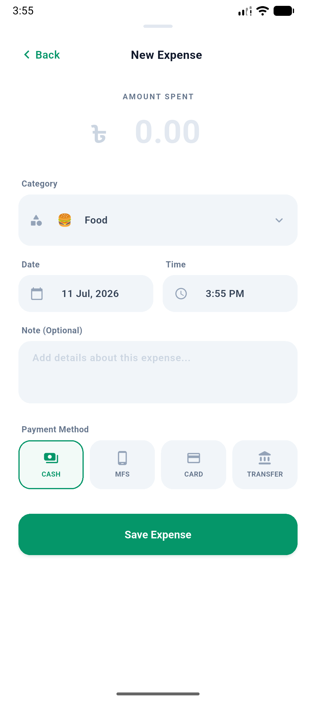</td>
  </tr>
  <tr>
    <td align="center" width="33%"><b>Income Summary</b><br/>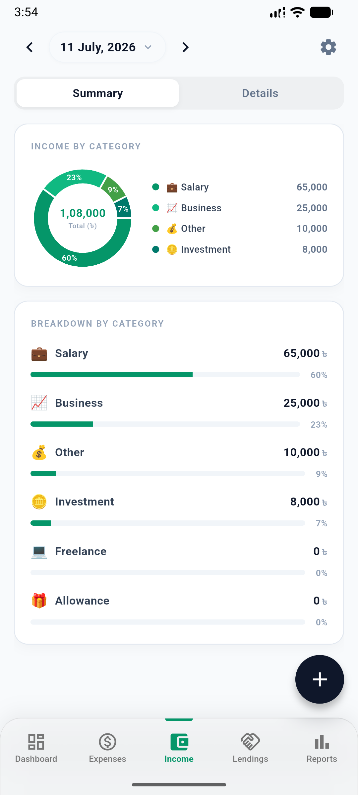</td>
    <td align="center" width="33%"><b>Income List</b><br/>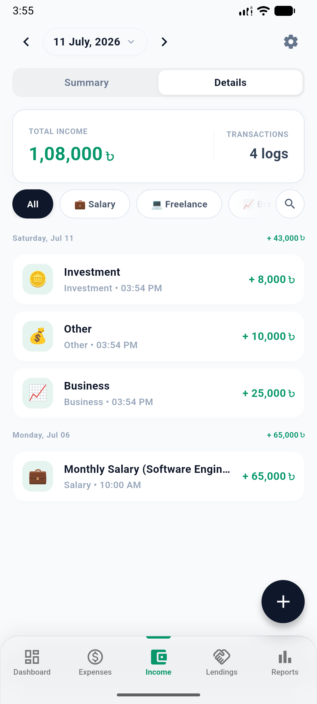</td>
    <td align="center" width="33%"><b>App Settings</b><br/>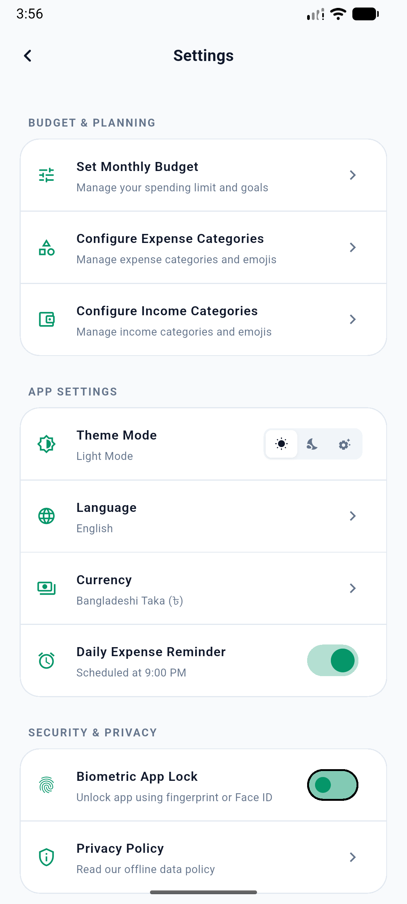</td>
  </tr>
  <tr>
    <td align="center" width="33%"><b>Lend Tracker (Given)</b><br/>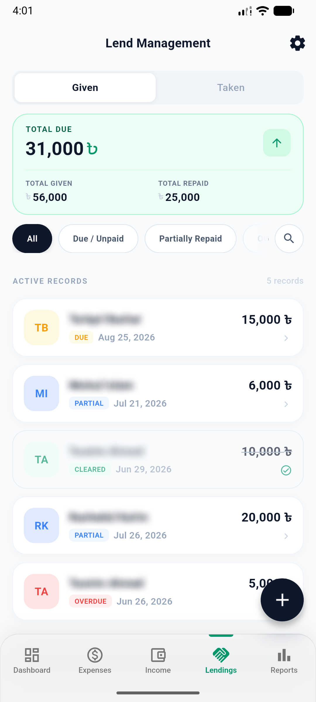</td>
    <td align="center" width="33%"><b>Lend Tracker (Taken)</b><br/>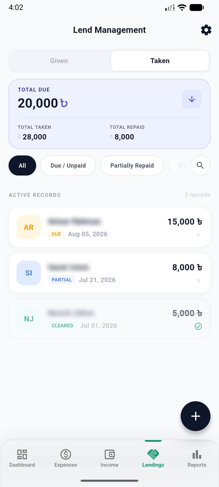</td>
    <td align="center" width="33%"><b>Record Debt/Repayment</b><br/>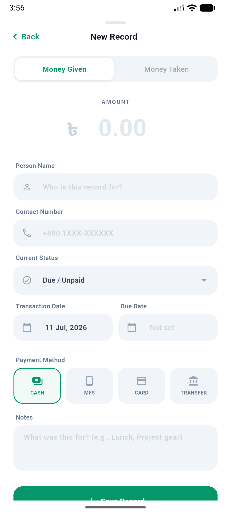</td>
  </tr>
</table>

---

## 🚀 Key Features

*   **Expense & Income Tracking**: Log transactions in seconds. Categorize with customizable headers and emojis.
*   **Budgeting System**: Establish monthly limits overall and per-category with real-time budget-overrun warnings.
*   **Smart Debt & Lending Tracker**: Log money given to or borrowed from contacts. Tracks partial repayments, due dates, and displays clear visual indicators for overdue debts.
*   **Investment Portfolio Yields**: Keep record of active investments, FDRs, and mutual funds. Log dividends and track historical ROI.
*   **Encrypted Backup & Restore**: Export manual backups or enable Daily Auto Backups (`.fkdb`) that run silently in the background, surviving app uninstallations on Android.
*   **Dual Storage Design**: 
    *   *Default (Offline Mode)*: Standard production builds run 100% offline, storing data locally via Hive boxes.
    *   *Personal Mode*: A toggle configuration allowing real-time Firestore sync and Firebase Auth login.

---

## 🏛️ Architecture & Tech Stack

FinKeep is architected to showcase production-grade Flutter design patterns, making it highly extensible, maintainable, and test-ready.

*   **Design Pattern**: Clean Architecture (separated into **Data**, **Domain**, and **Presentation** layers).
*   **State Management & DI**: [GetX](https://pub.dev/packages/get) for reactive controllers, state bindings, and dependency injection.
*   **Local Storage**: [Hive](https://pub.dev/packages/hive) for ultra-fast, local-first key-value storage.
*   **Cloud Infrastructure**: Firebase Auth for login management and Cloud Firestore for document storage.
*   **Notifications**: Local scheduler notifications for daily reminders and Firebase Cloud Messaging (FCM) for remote alerts.
*   **Routing**: Declarative navigation via GoRouter.

---

## 🚧 Setup & Local Installation

### Prerequisites
*   Flutter SDK (version `>=3.0.0`)
*   Android Studio / Xcode (for device emulators)

### Step-by-Step Installation
1.  **Clone the Repository**:
    ```bash
    git clone https://github.com/alxayeed/finkeep.git
    cd finkeep
    ```

2.  **Configure Environment**:
    Define your variables in `.env.prod` or `.env.personal`.

3.  **Get Package Dependencies**:
    ```bash
    flutter pub get
    ```

4.  **Run the Build Runner (for generated serialization files)**:
    ```bash
    dart run build_runner build --delete-conflicting-outputs
    ```

5.  **Launch FinKeep**:
    ```bash
    flutter run
    ```

---

## 📞 Contact & Portfolio Links

For queries, code walkthroughs, or collaboration opportunities, feel free to reach out:

*   **Email**: [alxayeed@gmail.com](mailto:alxayeed@gmail.com)
*   **LinkedIn**: [alxayeed](https://www.linkedin.com/in/alxayeed)
*   **Portfolio Website**: [alxayeed.github.io](https://alxayeed.github.io)
