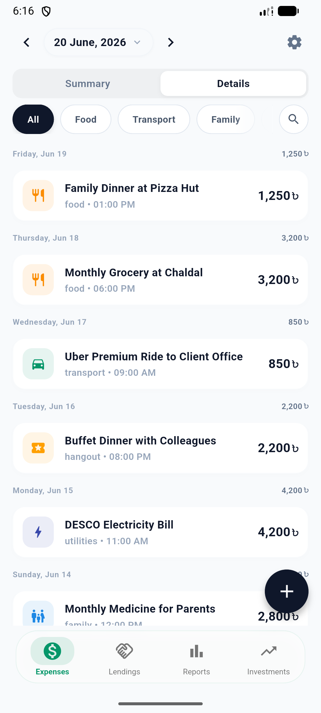
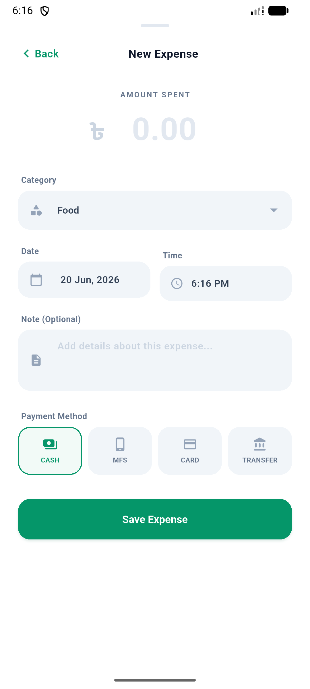
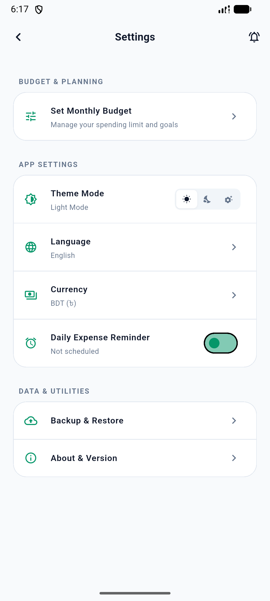

# FinKeep

Take complete control of your finances with FinKeep, a secure offline personal finance tracker. It keeps your sensitive records on your device without using cloud sync, tracking, or bank credentials. The app brings your daily expenses, monthly budgets, debt tracking, and investments into one simple dashboard.

For tracking expenses, you can record daily transactions quickly using categories like food, transport, and utilities. You can tag items by payment methods like cash, card, or mobile banking, and set daily reminders to log your habits

## 🎥 Preview

<table>
  <tr>
    <td></td>
    <td></td>
    <td></td>
  </tr>
  <tr>
    <td></td>
    <td></td>
    <td></td>
  </tr>
  <!-- <tr>
    <td></td>
    <td></td>
    <td></td>
  </tr> -->
</table>
 

### 🚀 Live Link

🟢 [Google Play Store](https://play.google.com/store/apps/details?id=com.raindropstudio.finkeep)

## 🚀 Features

- Expense Tracking: Log daily expenses and income with categories.
- Budget Management: Set monthly limits and monitor spending.
- Track your income of different categories
- Configure custom income and expense category
- Keep track of lends with smart tracking
- Keep an eye on your investments
- Cloud Sync: Securely backup data using Firebase.

### 🏛️ Architecture/Design

- Clean Architecture

## 🛠️ Tech Stack

- Flutter
- GetX
- Firebase
- Hive
- Local Notification
- Push Notification

[//]: # (## 📃 Motivation)

## 📦 Packages Used

- [Firebase core](https://pub.dev/packages/firebase_core)
- [GetX](https://pub.dev/packages/get)
- [Hive](https://pub.dev/packages/hive)
- [Firebase Messaging](https://pub.dev/packages/firebase_messaging)
- [Flutter Local Notifications](https://pub.dev/packages/flutter_local_notifications)
- firebase_messaging

## 🚧 Installation & Usage

1. Clone the repository: `git clone https://github.com/alxayeed/finkeep.git`
2. Navigate to the project directory: `cd finkeep`
3. Get dependencies: `flutter pub get`
4. Run the app: `flutter run`

## 📞 Contact

For any inquiries or collaboration requests, feel free to reach out
via [email](mailto:alxayeed@gmail.com) or connect
on [LinkedIn](https://www.linkedin.com/in/alxayeed).

