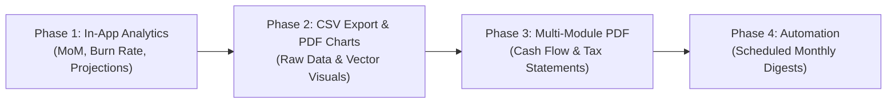

# FinKeep — Reporting, Analytics & Exporting Roadmap

This document outlines feature proposals, architectural considerations, and implementation tracks for advancing FinKeep's analytics engine and export capabilities.

---

## 📌 Feature Tracks Overview

| Track | Focus Area | Complexity | High-Level Value |
|---|---|:---:|---|
| **Track 1** | In-App Analytics & Velocity Insights | Medium | Gives users actionable insights, trend comparisons, and budget pacing directly within the UI. |
| **Track 2** | Multi-Module Financial Health Reports | High | Unifies Income, Expenses, Lendings, and Savings into comprehensive executive reports. |
| **Track 3** | Multi-Format & Automated Exporting | Medium | Power-user spreadsheet export (CSV/Excel) and monthly scheduled PDF digest delivery. |
| **Track 4** | PDF Visual Enhancements & Customization | Low-Med | Embedded vector charts and customizable headers for expense reimbursement / claims. |

---

## Track 1: In-App Analytics & Velocity Insights

### 1.1 Period-over-Period (MoM / YoY) Comparisons
- **Description**: Automatically compare current period performance against the previous period (e.g., this month vs. last month, or this fiscal year vs. last fiscal year).
- **Key Metrics**:
  - Net % change overall and per category (e.g., *"Food & Dining: ৳14,200 (+12% vs July)"*).
  - Anomaly detection flag (e.g., *"Unusual 45% spike in Utilities this month"*).
- **UI Placement**: Expandable comparison section or metric chips inside `ExpenseMonthlyAnalysis` and `ExpenseReportSummaryScreen`.

### 1.2 Budget vs. Actual Variance Analysis
- **Description**: Direct comparison between actual spending and set category/overall budgets.
- **Key Metrics**:
  - Variance in currency and percentage (e.g., Budget: ৳20,000, Actual: ৳18,500, Favorable Variance: +৳1,500 / 7.5%).
  - Visual status indicator: On Track (Green), Approaching Limit (Amber), Over Budget (Red).
- **UI Placement**: New "Budget Variance" card in Report Summary tab.

### 1.3 Daily Burn Rate & Month-End Projections
- **Description**: Real-time spending velocity calculation.
- **Key Metrics**:
  - Daily Average Burn Rate: `Current Total / Days Elapsed`.
  - Projected Month-End Spend: `Daily Burn Rate × Total Days in Month`.
  - Remaining Daily Allowance to stay within budget: `(Budget − Current Spend) / Days Remaining`.
- **UI Placement**: Summary header pill or Smart Insight banner.

### 1.4 Merchant / Payee Grouping
- **Description**: In addition to categories, aggregate transactions by recurring merchants / descriptions (e.g., Agora, Meena Bazar, Netflix, Uber, Pathao).
- **Key Metrics**:
  - Top 5 vendors by spend volume and frequency.

---

## Track 2: Multi-Module Financial Health Reports

### 2.1 Comprehensive Cash Flow & Net Savings Statement
- **Description**: An executive PDF & on-screen report bringing all 4 FinKeep pillars together:
  - **Inflow**: Total Income across all sources.
  - **Outflow**: Itemized Expenses across categories.
  - **Lendings/Debts**: Net change in money lent out vs. recovered.
  - **Savings & Investments**: Total deposits made, interest/profit received.
  - **Net Cash Flow / Savings Rate**: `(Income − Expenses) / Income × 100%`.
- **Output**: Multi-page PDF styled with FinKeep branding, breakdown tables, and net cash flow summary.

### 2.2 Annual Tax & Fiscal Year Pack
- **Description**: Grouping transactions across July–June fiscal cycles with tax-deductible category tags (e.g., Medical, Education, Charitable Donations, Sanchaypatra investments).
- **Key Metrics**:
  - Total Gross Income.
  - Tax-Rebate Eligible Investments (DPS, Sanchaypatra, Life Insurance).
  - Tax-Deductible Expenses.

### 2.3 Lending & Debt Status Statement
- **Description**: Customer/Personal account statement for lendings:
  - Outstanding balance per contact.
  - Due date timeline, payment history, and overdue status flags.
  - 1-tap "Share Account Statement" with debtor/creditor via WhatsApp/Email.

---

## Track 3: Multi-Format & Automated Exporting

### 3.1 CSV / Excel (.xlsx) Raw Data Export
- **Description**: Allow power users to export raw structured datasets for spreadsheet manipulation.
- **Columns**: `Date, Category, Description, Amount, Payment Method, Account, Notes, Reference ID`.
- **Packaging**: Standard UTF-8 CSV with optional currency symbol formatting toggle.

### 3.2 Automated End-of-Month Local Digest
- **Description**: On the 1st day of each new month, FinKeep triggers a local notification:
  - *"August Wrap-up: You saved ৳18,500 (24% of income). Tap to view your monthly PDF report."*
- **Action**: Tapping notification directly opens the generated PDF report viewer with share/save options.

---

## Track 4: PDF Visual Enhancements & Customization

### 4.1 Embedded Vector Charts in PDF
- **Description**: Render native PDF vector charts inside the summary section:
  - Top 5 Categories horizontal bar distribution.
  - Payment method share pie chart.
- **Technical Mechanism**: Utilizes `pdf/widgets.dart` `Chart` or custom vector path painter.

### 4.2 Custom Expense Claim / Memo Header
- **Description**: In the Filter Menu, allow an optional field:
  - `Report Title / Prepared For` (e.g., *"Official Travel Expense Claim - Client Visit"* or *"Submitted by: John Doe"*).
  - Optional custom footer note or approval signature line for workplace expense claims.

---

## 📋 Suggested Implementation Phases

